# Microsoft Ads: CanonicalEvent, UET CAPI og MCP

Statusdato: 2026-08-11.

## Dokumentasjonsstatus

Implementasjonen og provider-oppsettet er kontrollert mot oppdatert, offisiell
Microsoft-dokumentasjon:

- [UET Conversions API](https://learn.microsoft.com/en-us/advertising/guides/uet-conversion-api-integration?view=bingads-13)
- [Universal Event Tracking](https://learn.microsoft.com/en-us/advertising/guides/universal-event-tracking?view=bingads-13)
- [EventGoal](https://learn.microsoft.com/en-us/advertising/campaign-management-service/eventgoal?view=bingads-13)
- [Microsoft Advertising MCP](https://learn.microsoft.com/en-us/advertising/guides/mcp-setup?view=bingads-13)

Dokumentasjon og lokal runtime-kontekst er tilstrekkelig for løsningen som er
beskrevet her. Provideraksept er ikke det samme som attribusjon eller dokumentert
bruk i budalgoritmen; disse grensene er eksplisitt oppført nedenfor.

## Nåværende produksjonsstatus

- App: Vercel deployment `dpl_7D6w9RjSZdX6UNyxPZxsSFEaEQ5A`, `READY`,
  produksjonsalias `utekos.no`, commit
  `9236fe1197eb6542df5bd18c02859e176acb71d5`.
- Web-GTM: publisert versjon `141`.
- UET: tag `97247724` (`UtekosTag`, Active) brukes av begge annonsekontoene.
- Microsoft customer/manager: `254835341`.
- Primær annonsekonto: `188365141`.
- Andre annonsekonto: `188445594` (`G120L495`).
- UET CAPI autentiseres med UET-taggens ApiToken. Microsoft Ads OAuth-tokenet
  brukes bare mot Advertising API/MCP og må aldri brukes som CAPI-token.

### Customer-scoped CanonicalEvent-mål

De tre aktive EventGoals har `Scope=Customer` og gjelder begge annonsekontoene
under customer `254835341`. Begge kontoer bruker samme UET-tag og samme
dedupliserte eventstrøm.

| Goal ID | Action | Scope | Count | Budgivning | Status |
| ---: | --- | --- | --- | --- | --- |
| `47565453` | `add_to_cart` | Customer | Unique | Ekskludert | Active |
| `47565454` | `begin_checkout` | Customer | Unique | Ekskludert | Active |
| `47565502` | `purchase` | Customer | All | Inkludert | Active |

De seks tidligere kontoavgrensede målene er pauset: `47539433`, `47565274` og
`47565275` i konto `188365141`, samt `47565304`, `47565305` og `47565306` i
konto `188445594`. Customer-målene ble lest tilbake som aktive fra begge
account contexts etter cutover.

Mål `47538621` er ifølge operatørens Microsoft UI av typen Product og heter nå
`Product Backtrack`. Dette er et separat produktmål, ikke CanonicalEvent-målet
`purchase` (`47565502`). UI-koden med `PRODUCT_PURCHASE`, `ecomm_prodid`,
`ecomm_pagetype=PURCHASE` og valgfritt `pid` er dokumentert
installasjonsveiledning; den er ikke implementert i appen eller GTM som del av
denne endringen. Product-målets nye navn og UI-status er operatørobservasjon,
ikke Campaign Management-API-verifikasjon.

`NoRecentConversions` etter opprettelse er forventet og beviser ikke feil.
Providerens senere `TrackingStatus`, Reporting og kampanjedata må vise reelle
konverteringer før attribusjon eller algoritmebruk kan bekreftes.

## Reisen fra annonseklikk til Microsofts algoritmer

```mermaid
flowchart LR
  A["Klikk på Microsoft-annonsen"] --> B["Auto-tagging legger msclkid på URL"]
  B --> C["Utekos fanger klikk-ID og samtykkestatus"]
  C --> D["Autoritativ brukerhandling oppretter CanonicalEvent"]
  D --> E["Web-GTM sender browser-UET"]
  D --> F["Event API normaliserer og validerer"]
  F --> G["marketing.event_ledger"]
  G --> H["ops.provider_dispatch_attempts"]
  H --> I["Microsoft-adapter mapper samme eventId og eventName"]
  I --> J["POST capi.uet.microsoft.com/v1/97247724/events"]
  E --> K["Microsoft dedupliserer browser og server"]
  J --> K
  K --> L["Customer-scoped EventGoal matcher action"]
  L --> M["Reporting og conversion columns"]
  M --> N["Purchase kan brukes av automatisert budgivning"]
```



Én CanonicalEvent sendes én gang til tag `97247724`. Eventet skal ikke sendes
på nytt per annonsekonto; en ekstra CAPI-sending til samme tag kan doble signalet.
Customer-scoped EventGoals gjør de samme CanonicalEvent-handlingene tilgjengelige
i begge annonsekontoene under samme customer.

GTM-trigger `122` dekker de sju browser-eventene `view_item_list`,
`select_item`, `view_item`, `add_to_cart`, `begin_checkout`, `search` og
`generate_lead`. Purchase eies av den autoritative Shopify/server-kilden og er
derfor CAPI-only i dagens kontrakt; deduplisering mot browser gjelder bare
eventer som faktisk har begge transportveier.

### Parameterkontrakt

| Microsoft-felt | CanonicalEvent-kilde | Krav og hensikt |
| --- | --- | --- |
| `eventId` | `event_id` | Samme stabile UUID i browser-UET og CAPI for deduplisering og retry. |
| `eventName` | provider-mapping av `event_name` | Eksakt `add_to_cart`, `begin_checkout` eller `purchase`; må matche EventGoal action. |
| `eventTime` | `event_time` | Unix-sekunder innen Microsofts tillatte tidsvindu. |
| `eventSourceUrl` | `page_url` | Faktisk side der handlingen oppstod. |
| `adStorageConsent` | `consent.marketing` | Sendes som granted bare etter gyldig marketing-samtykke. |
| `msclkid` | `click_id.msclkid` | Sterkeste annonseklikk-kobling; beholdes gjennom CanonicalEvent og checkout-attribusjon. |
| `anonymousId` | `browser_id.microsoft_vid` | Samme GUID som brukes i Microsoft ID Sync; ikke GA client ID eller usynkronisert `_uetvid`. |
| `externalId`, `em`, `ph` | samtykket `user_data` | Alternative/støttende matchnøkler; e-post og telefon normaliseres og SHA-256-hashes. |
| `clientUserAgent`, `clientIpAddress` | request-kontekst | Sendes når kilden har legitim tilgang til dem. |
| `value`, `currency` | `custom_data` | Ordre-/handlekurvverdi og `NOK`. |
| `transactionId` | `custom_data.transaction_id` | Autoritativ ordre-ID for purchase. |
| `itemIds`, `items` | `custom_data.items` | Numerisk Shopify variant-ID som matcher Merchant-feeden. |

CAPI-kvalifisering er one-of: minst én støttet identifikator må finnes.
`msclkid` skal sendes når den finnes, men fravær av `msclkid` alene skal ikke
forkaste et ellers gyldig event med korrekt `anonymousId`, `externalId`, `em`
eller `ph`.

## Feil og suboptimal logikk som er rettet

1. Browser-UET manglet `event_id`, verdi, valuta og Merchant-produkt-ID-er.
   GTM v141 bruker nå den native Microsoft UET-tagtypen og sender den kanoniske
   kontrakten.
2. Custom HTML-varianten i GTM kjørte ikke. Den ble erstattet med den native
   `baut`-taggen i stedet for å omgå consent- eller triggerkontroller.
3. Microsoft ID Sync manglet eller ble forvekslet med Clarity MUID-sync.
   Marketing-samtykke fyrer nå en eksplisitt ID Sync med
   `Red3=BACID_254835341` og samme GUID som CAPI `anonymousId`.
4. CAPI brukte tidligere GA client ID som `anonymousId`. Løsningen bruker nå
   `browser_id.microsoft_vid` eller samme eksterne UUID.
5. Absolutt `msclkid`-gate forkastet lovlige events med andre støttede
   identifikatorer. Adapteren validerer nå Microsofts dokumenterte one-of-krav.
6. Shopify variant-GID ble sendt som produkt-ID. Den normaliseres nå til
   numerisk variant-ID som matcher Merchant-feeden.
7. Providerresponsen mistet `eventsReceived`, request-ID og
   valideringsdetaljer. Disse lagres nå uten å lagre `attemptedValue`.
8. Gammelt Begin Checkout-navn og PageView-mål kunne ikke gi korrekt
   CanonicalEvent-matching. De gamle målene er pauset; aktive mål matcher nå
   de kanoniske action-navnene.
9. Øvre trakt-mål kunne påvirke salgsbudgivning. Add To Cart og Begin Checkout
   er sekundære (`ExcludeFromBidding=true`); purchase er primært og teller alle
   salg med variabel NOK-verdi.
10. Dupliserte kontoavgrensede mål ga tungvint administrasjon og navnkonflikter.
    Tre Customer-scoped mål er nå aktive for begge kontoer; de seks gamle er
    pauset.
11. Utekos MCP var låst til én konto. Kontrakt v1.2 har et valgfritt,
    digits-only `accountId` på alle sju verktøy, eksplisitt allowlist og separat
    audit-cache per konto.

## Kompakt oppsettguide for CanonicalEvent + Microsoft UET CAPI

1. Bekreft customer, begge account IDs, UET-tag og auto-tagging med read-only
   Campaign Management-kall.
2. Bruk én felles UET-tag/eventstrøm når kontoene ligger under samme customer
   og samme tag skal måle nettstedet. Ikke dupliser CAPI-kall per konto.
3. Opprett EventGoals én gang med `Scope=Customer`, påkrevd `GoalCategory`,
   eksakt action-navn og UET-tag-ID. Scope kan ikke endres på eksisterende mål;
   opprett Customer-målene og paus de gamle Account-målene i en kontrollert
   cutover.
4. Bruk `Unique` og `ExcludeFromBidding=true` for diagnostiske Add To Cart og
   Begin Checkout. Bruk `All`, variabel NOK-verdi og
   `ExcludeFromBidding=false` for purchase.
5. Fang `msclkid` ved landingen, forny ved nytt Microsoft-klikk, og bevar den
   gjennom CanonicalEvent og Shopify checkout-attribusjon innenfor consent- og
   retention-kontrakten.
6. Etter marketing-samtykke: opprett en stabil Microsoft VID, gjennomfør ID
   Sync og bruk samme GUID i browser- og serverkontekst.
7. Valider ekstern input med CanonicalEvent/Zod før ledger. Bevar stabil
   `event_id` ved retry og normaliser produkt-ID, verdi, valuta og transaksjon.
8. Send browser-UET og CAPI med samme `eventId` og `eventName`. Browser-taggen
   går via consent-gated web-GTM; servereventet går direkte til UET CAPI.
9. Autentiser CAPI med UET ApiToken (`tagID` + bearer token), aldri Ads OAuth.
10. Lagre ledger, dispatchforsøk, HTTP-status, request-ID, `eventsReceived` og
    valideringsfeil/-advarsler. Klassifiser HTTP 200 som transportaksept, ikke
    som attribusjonsbevis.
11. Verifiser consent → dataLayer → browser-request → ledger → queue → CAPI →
    målstatus → Reporting. Bruk en reell ordre passivt; opprett aldri betaling
    eller ordre som smoke-test.

## MCP-oppsett for begge kontoer

Den lokale `utekos-microsoft-ads`-serveren er read-only og har sju verktøy for
snapshot, kontohelse, tracking, Merchant Center, diagnose, anbefalinger og
Reporting. Alle aksepterer nå valgfri `accountId`; uten verdi brukes
`MICROSOFT_ADS_ACCOUNT_ID`.

Ignorert `.env.mcp.local`:

```dotenv
MICROSOFT_ADS_CUSTOMER_ID=254835341
MICROSOFT_ADS_ACCOUNT_ID=188365141
MICROSOFT_ADS_MASTER_ACCOUNT_ID=188445594
MICROSOFT_ADS_MASTER_ACCOUNT_NUMBER=G120L495
MICROSOFT_ADS_MASTER_MANAGER_ACCOUNT_ID=254835341
MICROSOFT_ADS_MASTER_MANAGER_ACCOUNT_NUMBER=K120006WEF
```

Account number (`G120L495`) er ikke det samme som account ID (`188445594`).
MCP-input bruker alltid den numeriske ID-en. Ukjente konto-ID-er avvises før
providerkall.

```bash
source "$HOME/.nvm/nvm.sh" && nvm use --silent
npm run mcp:build
npm run mcp:microsoft-ads:registration:doctor -- --static --codex
npm run mcp:microsoft-ads:doctor
npm run mcp:microsoft-ads:doctor:live
npm run mcp:microsoft-ads:doctor:live -- --account-id=188445594
```

Den offisielle `microsoft-ads-official`-serveren og den lokale
`utekos-microsoft-ads`-serveren er to separate overflater. MCP er ikke
CAPI-transport; CanonicalEvent sender direkte til
`https://capi.uet.microsoft.com/v1/{tagId}/events`.

## Verifisert og fortsatt uverifisert

Verifisert:

- ingen Microsoft-request før marketing-samtykke i kontrollert nettleserflyt;
- én ID Sync med stabil GUID etter samtykke;
- `bat.js`, pageLoad og native browser-UET HTTP-suksess;
- browser `add_to_cart` med korrekt action, `event_id`, NOK-verdi og produkt-ID;
- CAPI `page_view` HTTP 200 med `eventsReceived=1` i Supabase;
- UET-tag, auto-tagging og kontoaksess for begge kontoer;
- tre aktive Customer-scoped CanonicalEvent-mål og seks pausede legacy-mål lest
  tilbake fra begge account contexts;
- Vercel `READY`-commit og GTM v141.

Ikke endelig verifisert:

- målmatching, deduplisering, attribusjon og bruk i budalgoritmen;
- en reell `add_to_cart`, `begin_checkout` og `purchase` hele veien gjennom
  providerstatus og Reporting;
- purchase via reell ordre. Ingen ordre eller betaling ble opprettet som test.

Det kontrollerte automatiserte Add To Cart-forsøket ble korrekt klassifisert
som `automated_bot` av BotID og ble ikke skrevet til serverleddet. Derfor er
browser-signalet verifisert, mens akkurat dette business-eventets CAPI-aksept
forblir produksjonsuverifisert.

`accepted_unverified` betyr teknisk transportaksept. Det beviser aldri alene
målmatching, deduplisering, attribusjon, rapportering eller budalgoritmebruk.
