# Microsoft Ads: CanonicalEvent, UET CAPI og MCP

Statusdato: 2026-08-10. Produksjonsfunnene er et read-only
øyeblikksbilde. Etter eksplisitt godkjenning er appkoden
implementert lokalt og GTM-endringene lagt i isolert workspace
`145`; workspace-et er ikke publisert, og ingen Microsoft-mål,
Vercel-deploy eller Supabase-rad er endret ennå.

Produksjonen som ble observert var Vercel `READY` på commit
`28bf4566dd327f540680dfef74bad2dab897ffc9` med aliasene til
`utekos.no`.

## Lokal implementeringsstatus etter godkjenning

Fase 1 og ID Sync/CAPI-kontrakten er implementert lokalt, men er
ikke deployet eller produksjonsverifisert:

- CAPI kvalifiserer nå på minst én støttet Microsoft-identifikator,
  ikke bare `msclkid`.
- `anonymousId` kommer fra den eksplisitte ID Sync-GUID-en
  (`browser_id.microsoft_vid`) eller samme anonyme eksterne UUID;
  Google Analytics client ID og usynkronisert `_uetvid` brukes ikke.
- Den samtykkede GUID-en bevares i CanonicalEvent og
  checkout-attribusjonen.
- Shopify variant-GID normaliseres til Merchant-feedens numeriske
  produkt-ID.
- Canonical `page_view` har egen CAPI `pageLoad`-adapter med
  `pageLoadId=page_view_id`; tilhørende custom events arver samme
  sidekontekst.
- Microsoft-svar projiserer `eventsReceived`, request-ID og
  valideringsdetaljer uten `attemptedValue`.
- Appen sender `microsoft_uet_id_sync` kun etter Cookiebot
  marketing-samtykke. GTM-workspace `145` mapper GUID-en til
  klientpikselen med `Red3=BACID_254835341` og samme `VID` som
  CAPI `anonymousId`.
- GTM-workspace `145` oppdaterer browser-UET med eksakt kanonisk
  `eventName`, `event_id`, verdi, valuta og normaliserte
  Merchant-produkt-ID-er.

Microsoft conversion goals er nå rettet og lest tilbake fra
Campaign Management v13:

- `47539433` Add To Cart: aktiv, `Unique`, ekskludert fra budgivning.
- `47546689` gammelt auto-Begin Checkout: pauset og ekskludert.
- `47554899` PageView: pauset og ekskludert.
- `47565274` Begin Checkout – CanonicalEvent: aktiv,
  `Action=begin_checkout`, `Unique`, ekskludert.
- `47565275` Purchase – CanonicalEvent: aktiv,
  `Action=purchase`, `All`, inkludert i budgivning og variabel
  NOK-verdi.

GTM-publisering og produksjonsdeploy gjenstår. Funnene nedenfor
beskriver derfor fortsatt den observerte pre-remediation-
produksjonen inntil en eksakt deployet commit og GTM-versjon er
verifisert ende til ende.

## Dokumentasjonsgrunnlag

- [Microsoft UET Conversions API](https://learn.microsoft.com/en-us/advertising/guides/uet-conversion-api-integration?view=bingads-13)
- [Microsoft Advertising MCP setup](https://learn.microsoft.com/en-us/advertising/guides/mcp-setup?view=bingads-13)
- [GetUetTagAuthKey](https://learn.microsoft.com/en-us/advertising/campaign-management-service/getuettagauthkey?view=bingads-13)
- [Shopify Storefront `Attribute`](https://shopify.dev/docs/api/storefront/latest/objects/Attribute)
- `FLOW.md`, `DEPLOYMENT.md`, `docs/analytics/event-matrix.md` og
  `docs/analytics/provider-finality-runbook.md`

## Faktisk reise i dagens løsning

```mermaid
flowchart LR
  A["Microsoft-annonsen klikkes"] --> B["Microsoft legger msclkid på landings-URL"]
  B --> C["Utekos lagrer siste msclkid i sessionStorage og localStorage i inntil 90 dager"]
  C --> D["Cookiebot marketing-samtykke"]
  D --> E["CanonicalEvent opprettes etter autoritativ brukerhandling"]
  E --> F["dataLayer til browser-UET i web-GTM"]
  E --> G["/api/events/* til CanonicalEvent-normalisering"]
  G --> H["marketing.event_ledger"]
  H --> I["ops.provider_dispatch_attempts"]
  I --> J["Microsoft UET-worker mapper add_to_cart, begin_checkout eller purchase"]
  J --> K["POST capi.uet.microsoft.com/v1/{tagId}/events"]
  K --> L["Microsoft validerer, matcher mål, dedupliserer og attribuerer"]
  L --> M["Konverteringssignal kan brukes av rapportering og budalgoritmer"]
```



Viktige parameterkilder:

| Microsoft-felt                       | CanonicalEvent-kilde              | Nåværende status                                                            |
| ------------------------------------ | --------------------------------- | --------------------------------------------------------------------------- |
| `eventId`                            | `event_id`                        | Stabil UUID på CAPI; mangler i live browser-UET-taggen                      |
| `eventName`                          | provider-mapping av `event_name`  | Lokalt: `add_to_cart`, `begin_checkout`, `purchase`; produksjon er eldre    |
| `eventTime`                          | `event_time`                      | Konverteres til Unix-sekunder                                               |
| `eventSourceUrl`                     | `page_url`                        | Tilgjengelig når kildeflyten har URL                                        |
| `adStorageConsent`                   | `consent.marketing`               | CAPI sendes bare som `G` etter innvilget marketing-samtykke                 |
| `msclkid`                            | `click_id.msclkid`                | Siste verdi lagres i 90 dager og følger Shopify cart-attributter            |
| `anonymousId`                        | UET ID Sync `VID`                 | Lokalt korrekt GUID; produksjon er ikke verifisert                          |
| `externalId`                         | `external_id`                     | Tilgjengelig med marketing-samtykke                                         |
| `em`, `ph`                           | normalisert SHA-256 i `user_data` | Mest komplett på purchase fra Shopify                                       |
| `clientUserAgent`, `clientIpAddress` | nettleser/server-kontekst         | Tilgjengelig når kilden leverer dem                                         |
| `value`, `currency`, `transactionId` | `custom_data`                     | Finnes i CAPI-mappingene                                                    |
| `itemIds`, `items`                   | `custom_data.items`               | Lokalt normalisert til numerisk variant-ID; produksjon er ikke verifisert   |

`accepted_unverified` betyr at adapteren behandlet svaret som
teknisk aksept. Det beviser ikke målmatching, deduplisering,
attribusjon eller at signalet ble brukt i budgivningen.

## Produksjonsfunn før remediation

### Høy prioritet

1. Microsoft rapporterer klikk og spend, men null kvalifiserte
   konverteringer. Den aktive kontoen har 4 623 klikk i det leste
   rapportvinduet, mens `allConversionsQualified` er 0.
2. Live conversion-goal for Begin Checkout forventer handlingen
   `AutoEvent_begin_checkout`, mens både browser-taggen og CAPI
   sender `begin_checkout`. Målmatching er derfor ikke
   konsistent.
3. Det lesbare Event-goal-settet inneholder ikke et aktivt
   purchase-mål som matcher CAPI-navnet `PRODUCT_PURCHASE`.
   Product-goal-overflaten må kontrolleres separat før dette
   klassifiseres som endelig fravær.
4. Add To Cart, Begin Checkout og PageView er ikke ekskludert fra
   budgivning. For en salgskonto kan dette lære algoritmen å
   kjøpe billige øvre trakt-hendelser i stedet for ordre.
   Kampanjens goal set må bekrefte den endelige effekten.
5. Av 620 lagrede Microsoft-dispatcher er bare 6
   `accepted_unverified`. 404 er hoppet med `missing_msclkid`;
   208 historiske rader ble hoppet fordi adapteren var
   utilgjengelig etter resetten. De kvalifiserte hoppene har
   ingen aktive failures, men de gir heller ingen
   Microsoft-signalverdi.
6. `msclkid` er svært viktig, men offisiell CAPI krever ikke
   akkurat denne identifikatoren. `userData` må ha minst én
   støttet identifikator. Dagens absolutte `msclkid`-gate kaster
   derfor bort lovlige hendelser som kunne vært sendt med korrekt
   `anonymousId`, `externalId`, `em` eller `ph`.

### Datakvalitet og deduplisering

1. Live GTM v136 har UET-taggen
   `Microsoft UET – Canonical business events`, men den sender
   bare `customEventAction={{Event}}`. Canonical `event_id`,
   verdi, valuta og varelinjer videresendes ikke. Browser-UET og
   CAPI kan da ikke dokumenteres som samme konvertering.
2. Etter førstegangs samtykke ble ingen Microsoft UET-request
   eller `_uetvid` observert før siden ble lastet på nytt. Etter
   reload ble `bat.js`, UET pageLoad og `_uetvid` observert.
   Førstesidekonverteringer etter samtykke kan derfor miste
   browser-kontekst.
3. Det ble observert en `c.bing.com/c.gif`-request fra Clarity
   sin MUID-sync, men ikke den dokumenterte CAPI ID
   Sync-requesten med `Red3=BACID_<CID>` og `VID`. Clarity-sync
   er ikke bevis for CAPI ID Sync.
4. CAPI `anonymousId` settes fra Google Analytics client ID.
   Microsoft krever at den matcher `VID` fra klientens ID Sync.
5. Checkout-attribusjonen bevarer `msclkid`, Meta- og
   Google-identifikatorer, men ikke UET visitor/session ID.
   Dermed mister Shopify purchase-kilden den beste Microsoft
   browser-identiteten.
6. Add To Cart og Begin Checkout bruker full Shopify variant-GID
   som `itemIds`. Microsoft Merchant-feeden bruker numerisk
   variant-ID. Dette svekker eller bryter dynamisk
   remarketing-matching.
7. HTTP 200-responskroppen kastes i senderne. `eventsReceived` og
   `ValidationWarning` blir ikke lagret, selv om Microsoft kan
   fjerne ugyldige valgfrie felter og fortsatt svare 200.
8. De seks eldre `accepted_unverified`-radene har ikke
   HTTP-status i den autoritative kolonnen og mangler request-ID.
   Dette er utilstrekkelig provider-finality-bevis.

### MCP

1. Den lokale `utekos-microsoft-ads`-serveren og
   ChatGPT-tunnelprofilen er registrert og alle sju
   read-only-verktøy blir oppdaget.
2. Live Utekos Microsoft Ads-plugin leste konto, UET, conversion
   goals, reporting, Merchant Center og Ad Insight uten kritiske
   read failures.
3. Microsoft OAuth roterte refresh token i sesjonen. Det nye
   tokenet må persisteres i godkjent secret store før prosessen
   restartes; ellers er tilkoblingen ikke restart-sikker.
4. Full account snapshot kunne tidligere inkludere Reporting sin
   signerte nedlastings-URL. Wire-normaliseringen fjerner nå
   URL-en og `allRows`.
5. Microsoft sin offisielle remote MCP er registrert i de
   genererte klientkonfigurasjonene, men Codex OAuth stopper før
   samtykkeskjermen fordi serverens authorization metadata
   annonserer `organizations` som issuer og returnerer
   `{tenantid}`. Den offisielle remoten er derfor konfigurert,
   men ikke autentisert i Codex. Dette påvirker ikke den fungerende
   lokale Utekos-serveren eller direkte UET CAPI-transport.

## Korrekt målarkitektur for CanonicalEvent og CAPI

1. **Definer ett provider-contract per konvertering.** Bruk
   eksakt samme UET tag-ID, `eventId` og `eventName` i
   browser-UET og CAPI. Anbefalt CanonicalEvent-navn er
   `add_to_cart`, `begin_checkout` og `purchase`.
   Microsoft-målene må bruke nøyaktig de samme action-navnene.
2. **Gjør purchase til primært salgsmål.** Bruk
   `CountType=Unique`, variabel NOK-verdi og inkluder dette i
   budgivning. Behold Add To Cart og Begin Checkout som
   diagnostiske/sekundære mål og ekskluder dem fra budgivning med
   mindre en eksplisitt kampanjestrategi krever noe annet.
   PageView skal ikke være primært salgssignal.
3. **Bevar klikkidentiteten.** Fang siste `msclkid` på første
   request, overskriv ved nytt Microsoft-klikk og behold
   maksimalt 90 dager. Bevar den gjennom redirects,
   CanonicalEvent og Shopify cart-attributter. Fjern den når
   marketing-samtykke ikke finnes.
4. **Fullfør ID Sync.** Etter marketing-samtykke, fyr klient-side
   `https://c.bing.com/c.gif` minst én gang per sesjon med
   Microsoft-kundens `Red3=BACID_<CID>` og en stabil `VID`. Samme
   `VID` skal lagres som `browser_id.microsoft_vid`,
   følge checkout-attribusjonen og mappes til CAPI
   `userData.anonymousId`.
5. **Valider `userData` som one-of.** Hver CAPI-hendelse må ha
   minst én av `anonymousId`, `externalId`, `em`, `ph`,
   `msclkid`, `idfa` eller `gaid`. Send `msclkid` når den finnes,
   men hopp bare hendelsen når alle støttede identifikatorer
   mangler.
6. **Normaliser produkt-ID.** Konverter Shopify
   `gid://shopify/ProductVariant/<id>` til `<id>` før `itemIds`
   og `items[].id` bygges, slik at verdien matcher
   Merchant-feedens `id`.
7. **Send komplett payload direkte til CAPI.** Bruk
   `POST https://capi.uet.microsoft.com/v1/{tagId}/events` med
   UET ApiToken, ikke Microsoft Ads OAuth-token og ikke MCP.
   Bevar stabil `eventId` på retry, Unix-sekunder innen syv
   dager, `adStorageConsent=G`, URL, UA/IP, verdi, valuta,
   transaksjons-ID og varelinjer når de er tillatt og
   tilgjengelige.
8. **Gjør browser-taggen lik CAPI.** GTM må sende CanonicalEvent
   sitt `event_id`, eventnavn og samme kommersielle parametere.
   Førstegangs samtykke må starte UET uten reload.
   GTM-publisering krever separat eksplisitt godkjenning.
9. **Lagre responssemantikk.** Parse og lagre HTTP-status,
   request-ID, `eventsReceived`, antall validation
   errors/warnings og feltsti/feilkode uten å lagre
   `attemptedValue`. HTTP 200 med warning er delvis datatap, ikke
   grønn provider-finality.
10. **Verifiser hele kjeden.** Kjør payload- og enhetstester,
    deretter eksakt READY-commit i produksjon: consent, landing
    med ekte Microsoft-klikk, `dataLayer`, browser-UET-request,
    CanonicalEvent-rad, outbox-rad, CAPI-svar, UET
    Dashboard-parametere, conversion-goal-status og Reporting.
    Bruk en reell ordre som passiv korrelasjon; opprett aldri
    ordre eller betaling som smoke-test.

## MCP-oppsett

To MCP-overflater skal eksistere side om side:

- `microsoft-ads-official`: Microsoft sin remote MCP for Ads
  API-operasjoner og kontoressurser.
- `utekos-microsoft-ads`: Utekos sin read-only operator for
  kontohelse, tracking, Merchant Center, rapporter og
  CanonicalEvent/Supabase-bevis.

Registrer og verifiser lokalt:

```bash
source "$HOME/.nvm/nvm.sh" && nvm use --silent
npm run mcp:microsoft-ads:register
npm run mcp:microsoft-ads:registration:doctor -- --static --codex
npm run mcp:microsoft-ads:doctor
```

Kildekonfigurasjonen bruker Microsofts dokumenterte
OpenBeta-endpoint for Cursor og VS Code:

```text
https://partner.api.bingads.microsoft.com/ext/mcp/vnext?toolSetNames=OpenBeta
```

Codex og ChatGPT-connectoren bruker den kanoniske OAuth-ressursen
uten query-string. Microsofts resource metadata avviser
query-URL-en ved Codex OAuth-login:

```text
https://partner.api.bingads.microsoft.com/ext/mcp/vnext
```

Med den kanoniske URL-en stopper dagens Codex-klient deretter på
Microsoft-serverens issuer-metadata før samtykke:

```text
Authorization server issuer mismatch: expected .../organizations/v2.0,
received .../{tenantid}/v2.0
```

OAuth-oppsettet i den eksisterende Entra-appen skal ha sign-in
audience `AzureADandPersonalMicrosoftAccount`, scope
`https://ads.microsoft.com/msads.manage`, tom Resource-verdi og
ChatGPT sin genererte Callback URL registrert som public-client
redirect URI. App- eller client-secret skal aldri legges i
genererte MCP-filer.

Den offisielle MCP-serveren er ikke CAPI-transport.
CanonicalEvent-workerne skal fortsatt sende konverteringer
direkte til UET CAPI. MCP brukes til oppsett, lesing, diagnostikk
og verifikasjon.
